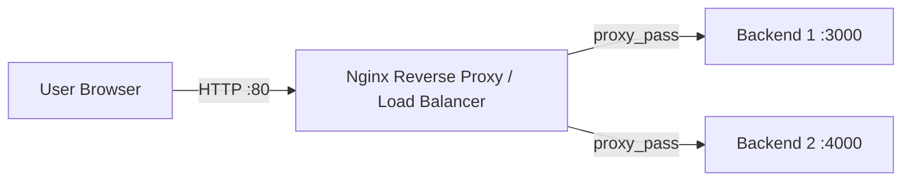

# Nginx Reverse Proxy & Load Balancing Practical

## Overview

This practical demonstrates:

- Nginx as a reverse proxy
- Nginx round-robin load balancing
- Two backend services on ports `3000` and `4000`
- Browser access through EC2 public IP on port `80`
- AWS Security Group configuration
- Backend testing and failure testing
- Nginx logs and troubleshooting

## Architecture



## Request Flow

```text
Browser
   |
   | http://EC2_PUBLIC_IP
   | TCP :80
   v
+-----------------------+
| NGINX                 |
| Reverse Proxy + LB    |
+----------+------------+
           |
      Round Robin
       /       \
      v         v
+---------+  +---------+
| Backend |  | Backend |
| 1 :3000 |  | 2 :4000 |
+---------+  +---------+
```

## Important Concept

The browser communicates only with Nginx:

```text
Browser → EC2 Public IP:80 → Nginx
```

Nginx communicates internally with:

```text
127.0.0.1:3000
127.0.0.1:4000
```

Therefore, ports `3000` and `4000` do not need to be publicly exposed for this single-EC2 practical.

## Expected Result

Opening:

```text
http://YOUR_EC2_PUBLIC_IP
```

should display Backend 1 or Backend 2.

Repeated requests are distributed between the two backends.

---

# Project Learning Outcomes

After completing this practical, you should understand:

1. Reverse proxy
2. Upstream servers
3. Round-robin load balancing
4. Proxy headers
5. Public vs private ports
6. AWS Security Groups
7. Nginx configuration testing
8. Nginx reload vs restart
9. Access and error logs
10. Basic backend failure testing
