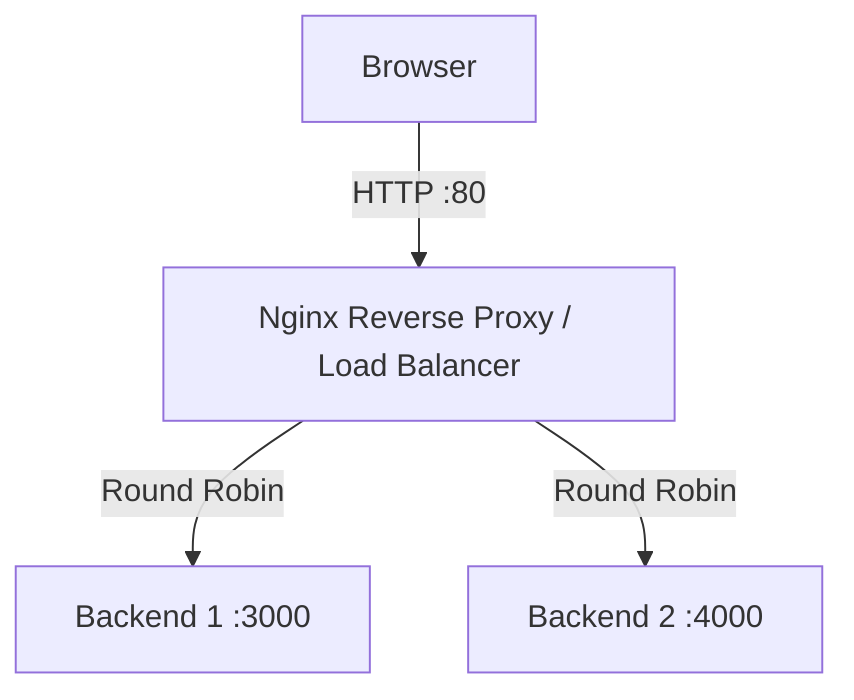

# Nginx Reverse Proxy + Load Balancing — Step-by-Step Practical

## Architecture

```text
                    Internet
                       |
                       | HTTP :80
                       v
              +-------------------+
              |       NGINX       |
              | Reverse Proxy / LB|
              +---------+---------+
                        |
                 Round Robin
                  /        \
                 v          v
          +----------+  +----------+
          | Backend 1|  | Backend 2|
          |   :3000  |  |   :4000  |
          +----------+  +----------+
```

# Step 1 — Launch / Prepare Ubuntu EC2

Use an Ubuntu EC2 instance.

Make sure the instance has a Public IPv4 address.

Connect using SSH:

```bash
ssh -i "your-key.pem" ubuntu@YOUR_EC2_PUBLIC_IP
```

# Step 2 — Configure AWS Security Group

Add these inbound rules:

| Type | Port | Source | Purpose |
|---|---:|---|---|
| SSH | 22 | Your IP | SSH |
| HTTP | 80 | 0.0.0.0/0 | Browser → Nginx |

For this practical, do not expose `3000` and `4000` publicly.

# Step 3 — Update Ubuntu

```bash
sudo apt update
```

# Step 4 — Install Nginx and Python

```bash
sudo apt install nginx python3 -y
```

Check Nginx:

```bash
sudo systemctl status nginx
```

# Step 5 — Create Backend 1

```bash
sudo mkdir -p /var/www/backend1
```

Create:

```bash
sudo nano /var/www/backend1/index.html
```

Add:

```html
<!DOCTYPE html>
<html>
<head>
    <title>Backend Server 1</title>
</head>
<body>
    <h1>Backend Server 1</h1>
    <h2>Port: 3000</h2>
    <p>This request was served by Backend Server 1.</p>
</body>
</html>
```

# Step 6 — Start Backend 1

```bash
cd /var/www/backend1
python3 -m http.server 3000 --bind 127.0.0.1
```

Expected:

```text
Serving HTTP on 127.0.0.1 port 3000
```

Keep this terminal running.

# Step 7 — Create Backend 2

Open another SSH terminal.

```bash
sudo mkdir -p /var/www/backend2
```

Create:

```bash
sudo nano /var/www/backend2/index.html
```

Add:

```html
<!DOCTYPE html>
<html>
<head>
    <title>Backend Server 2</title>
</head>
<body>
    <h1>Backend Server 2</h1>
    <h2>Port: 4000</h2>
    <p>This request was served by Backend Server 2.</p>
</body>
</html>
```

# Step 8 — Start Backend 2

```bash
cd /var/www/backend2
python3 -m http.server 4000 --bind 127.0.0.1
```

Expected:

```text
Serving HTTP on 127.0.0.1 port 4000
```

Keep this terminal running.

# Step 9 — Test Backend 1

Open another SSH terminal:

```bash
curl http://127.0.0.1:3000
```

Expected:

```text
Backend Server 1
Port: 3000
```

# Step 10 — Test Backend 2

```bash
curl http://127.0.0.1:4000
```

Expected:

```text
Backend Server 2
Port: 4000
```

# Step 11 — Check Ports

```bash
sudo ss -lntp
```

You should see ports similar to:

```text
127.0.0.1:3000
127.0.0.1:4000
0.0.0.0:80
```

# Step 12 — Remove Nginx Default Configuration

```bash
sudo rm -f /etc/nginx/sites-enabled/default
```

# Step 13 — Create Load Balancer Configuration

```bash
sudo nano /etc/nginx/sites-available/loadbalance
```

Add:

```nginx
upstream backend_servers {
    server 127.0.0.1:3000;
    server 127.0.0.1:4000;
}

server {
    listen 80;
    listen [::]:80;

    server_name _;

    access_log /var/log/nginx/loadbalance_access.log;
    error_log /var/log/nginx/loadbalance_error.log;

    location / {
        proxy_pass http://backend_servers;

        proxy_http_version 1.1;

        proxy_set_header Host $host;
        proxy_set_header X-Real-IP $remote_addr;
        proxy_set_header X-Forwarded-For $proxy_add_x_forwarded_for;
        proxy_set_header X-Forwarded-Proto $scheme;

        proxy_connect_timeout 5s;
        proxy_read_timeout 30s;
        proxy_send_timeout 30s;
    }
}
```

# Step 14 — Enable Configuration

```bash
sudo ln -s /etc/nginx/sites-available/loadbalance /etc/nginx/sites-enabled/loadbalance
```

Check:

```bash
ls -l /etc/nginx/sites-enabled/
```

# Step 15 — Test Nginx Configuration

Always test before reloading:

```bash
sudo nginx -t
```

Expected:

```text
syntax is ok
test is successful
```

# Step 16 — Reload Nginx

```bash
sudo systemctl reload nginx
```

Check:

```bash
sudo systemctl status nginx
```

# Step 17 — Test Through Nginx

```bash
curl http://127.0.0.1
```

Run multiple requests:

```bash
for i in {1..10}; do
    curl -s http://127.0.0.1 | grep -E "Backend Server|Port:"
done
```

You should see responses from both backends.

# Step 18 — Get EC2 Public IP

```bash
curl ifconfig.me
```

Example:

```text
3.110.xx.xx
```

# Step 19 — Open in Browser

On your Windows/browser:

```text
http://YOUR_EC2_PUBLIC_IP
```

Do not use:

```text
http://YOUR_EC2_PUBLIC_IP:3000
```

or:

```text
http://YOUR_EC2_PUBLIC_IP:4000
```

The browser should connect to port 80, and Nginx will forward the request internally.

# Step 20 — Test Load Balancing From Browser

Refresh the page multiple times.

You should see:

```text
Backend Server 1
Port: 3000
```

and:

```text
Backend Server 2
Port: 4000
```

# Step 21 — Test Backend Failure

Stop Backend 1 with:

```text
CTRL + C
```

Then test:

```bash
curl http://127.0.0.1
```

Nginx will attempt the upstream group. For a production system, use proper service management and health-check mechanisms.

# Step 22 — Monitor Nginx Logs

Access log:

```bash
sudo tail -f /var/log/nginx/loadbalance_access.log
```

Error log:

```bash
sudo tail -f /var/log/nginx/loadbalance_error.log
```

# Step 23 — Useful Commands

```bash
sudo nginx -t
sudo nginx -T
sudo systemctl status nginx
sudo systemctl start nginx
sudo systemctl stop nginx
sudo systemctl restart nginx
sudo systemctl reload nginx
sudo ss -lntp
pidof nginx
ps aux | grep nginx
```

# Final Architecture


